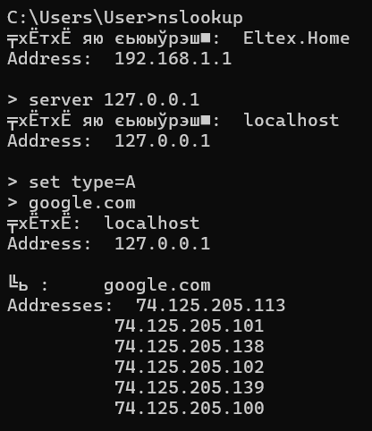

# Task 2
Кэширующий DNS-сервер - это сервер, который хранит копии ответов на DNS-запросы в памяти, чтобы можно было быстро отвечать на повторные запросы к одним и тем же DNS-записям. Это повышает производительность и снижает задержку, поскольку серверу не нужно каждый раз запрашивать записи у вышестоящих DNS-серверов.

Этот проект представляет собой простой кэширующий DNS-сервер, написанный на языке Python. Он поддерживает типы DNS-запросов A, AAAA и NS. Когда сервер получает DNS-запрос, он сначала проверяет свой кэш, чтобы узнать, есть ли у него уже ответ на этот запрос. Если ответ есть в кэше, сервер немедленно возвращает его клиенту. Если ответа в кэше нет, сервер запрашивает запись у вышестоящих DNS-серверов и сохраняет полученный ответ в своем кэше.

## Использование:
1. Прописать необходимые настройки в файле `config.json`:   
   * Для локального запуска ничего не трогать.  
   * Для внешних устройств изменить `server_ip` на ваш адрес в сети.
2. Из папки DNS_server написать в терминал:
    ```
    python main.py
    ```

## Пример работы:
