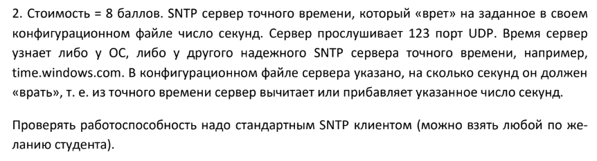

# SNTP-сервер

Задание
-------



Описание
--------
SNTP-сервер - это простая реализация сервера времени, основанная на протоколе Simple Network Time Protocol (SNTP). Сервер может предоставлять точное время клиентам, а также может добавлять заданное смещение к текущему времени, чтобы "врать" на указанное значение.

Использование
--------------

Чтобы запустить SNTP-сервер, выполните следующую команду в командной строке:

```shell
py main.py
```

Настройка
---------

Настройки SNTP-сервера задаются в файле `config.json`:

*   `server_ip`: IP-адрес, на котором будет слушать сервер.
*   `server_port`: Порт, на котором будет слушать сервер. Установите значение `123`, чтобы использовать стандартный порт SNTP.
*   `offset`: Смещение времени в секундах, которое будет добавлено к текущему времени. Используется для создания эффекта "врать" серверу.
*   `stratum`: Уровень сервера. Задайте значение `1`, чтобы указать, что сервер имеет самый высокий уровень.
*   `leap_indicator`: Индикатор прыжка. Задайте значение `0`, чтобы указать, что нет прыжка во времени.
*   `version_number`: Номер версии SNTP-протокола, которым оперирует сервер.

