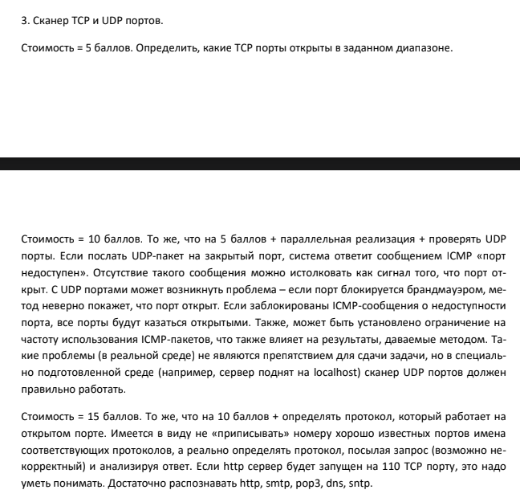
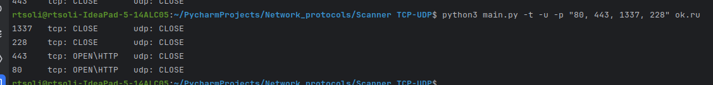

# Задание 



# Описание

Scanner TCP-UDP - консольная утилита, разработанная для сканирования TCP и UDP портов на указанном хосте. Утилита способна определить протокол, который работает на открытом порту, такие как HTTP, SMTP, POP3, SNTP и другие.

# Использование

```shell
usage: python3 main.py [-h] [-t] [-u] [-p PORTS] host  

positional arguments:
   host                  this host will be scanned.
    
optional arguments:
   -h, --help            show this help message and exit
   -t                    the program will scan tcp ports.
   -u                    the program will scan udp ports.
   -p PORTS, --ports PORTS
                         this port range will be scanned.
```

# Пример



