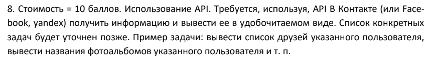
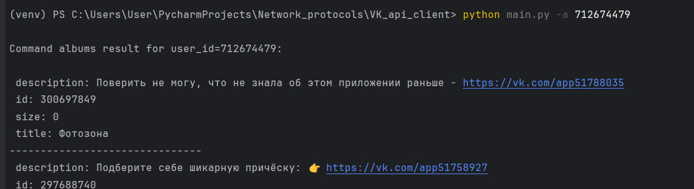

# Задание



# Описание 

VK API Client - это консольная утилита на Python, которая предоставляет доступ к VK API для получения информации о пользователях, их друзьях и альбомах.

# Настройки

Для работы утилиты необходимо настроить файл `settings.json`, который содержит следующую информацию:


```json
{   
  "vk_api_url": "https://api.vk.com/method/",   
  "access_token": "your_token",   
  "vk_api_version": "5.131"
}
```

*   `vk_api_url` - URL-адрес VK API.
*   `access_token` - ваш токен доступа VK API.
*   `vk_api_version` - версия VK API.

# Использование

```shell
py main.py [-h] [-f] [-a] [-u] [-c COUNT] user_id
```

# Пример



